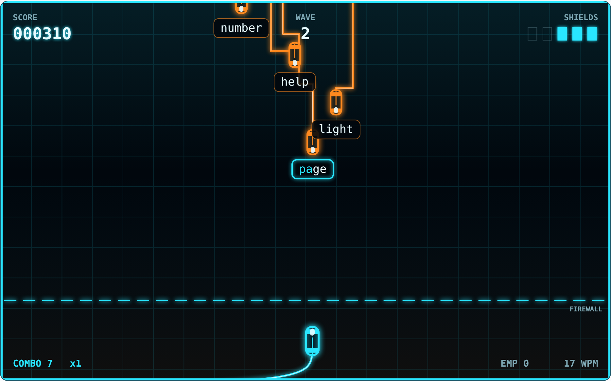
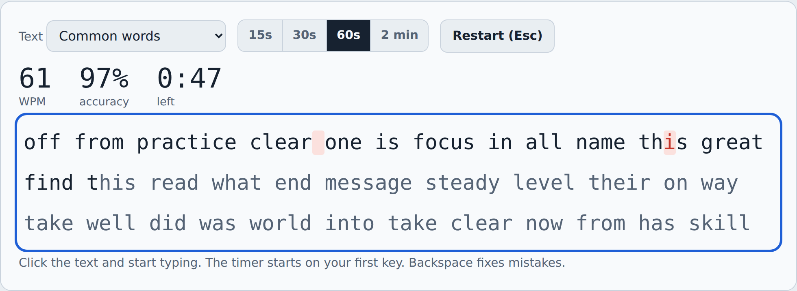
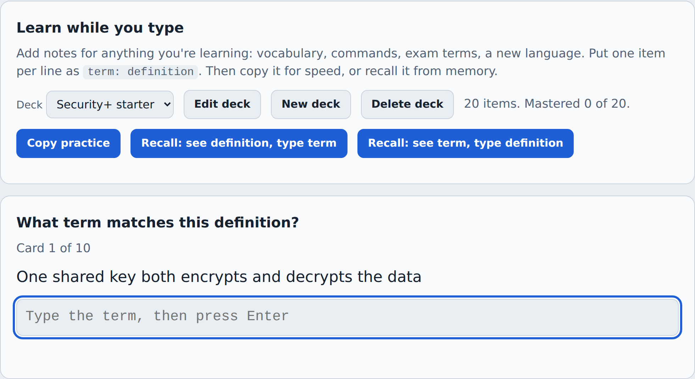
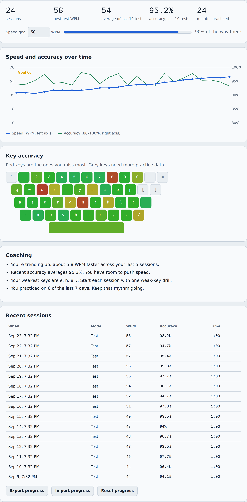
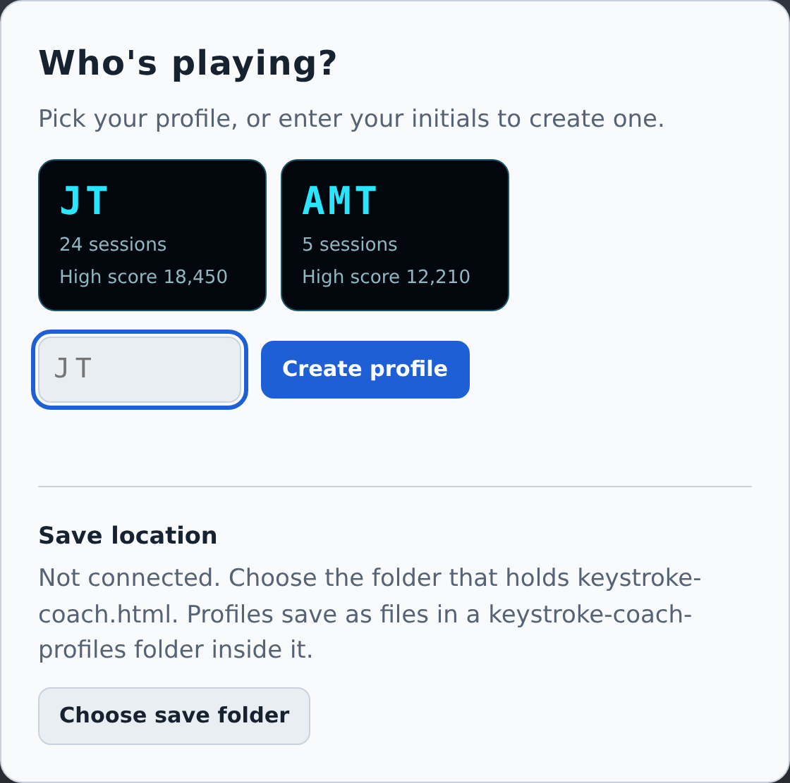

<div align="center">



<br>

**A typing trainer that runs in one HTML file. It coaches you, drills your weak keys, reads to you, and turns practice into a Tron-style arcade game.**

<br>


[Quick start](#-quick-start) · [Features](#-features) · [Grid Defense](#-grid-defense) · [Built with Claude](#-built-with-claude) · [Saving](#-profiles-and-saving)

<br>



</div>

<br>

## 🤖 Built with Claude

Keystroke Coach was designed and built in conversation with **Claude**, Anthropic's AI assistant. The goal was simple: **help someone become a faster, more accurate typist**, and make the practice worth coming back to every day.

Every feature started as a plain-language request. Claude turned each one into working code:

| The request | What Claude built |
| :-- | :-- |
| *"Test my speed and help me improve"* | Live WPM and accuracy, per-key error tracking, and coaching notes after every session |
| *"Typing audio"* | Dictation mode that reads sentences aloud and scores what you heard word by word |
| *"Shorthand"* | Abbreviation drills plus a pad that expands shorthand as you write |
| *"While learning any new skill"* | Custom study decks with copy practice and active-recall rounds |
| *"Make it a real game, think Tron"* | **Grid Defense**, a light-cycle arcade game played entirely by typing |
| *"Save progress to the folder, with a profile"* | Initials-based profiles saved as JSON files next to the app |

The result is one self-contained file with no frameworks, build steps, accounts, or servers.

<br>

## 🚀 Quick start

```text
1. Download keystroke-coach.html into its own folder
2. Open it in Chrome or Edge (double-click works)
3. Enter your initials to create a profile
4. Click "Choose save folder" and pick that same folder
5. Start with a 60-second speed test
```

> [!TIP]
> A strong daily routine takes about 15 minutes: one speed test, one weak-key drill, one learning round, then a game of Grid Defense as a reward.

<br>

## ✨ Features

<table>
<tr>
<td width="50%" valign="top">

### ⌨️ Speed test
Timed tests from 15 seconds to 2 minutes. Type common words, full sentences, numbers and symbols (IP addresses, ports, commands), Security+ vocabulary, or your own study deck. Mistakes highlight in real time. Your WPM and accuracy update as you type.

</td>
<td width="50%">



</td>
</tr>
<tr>
<td width="50%">



</td>
<td width="50%" valign="top">

### 🧠 Learn a skill
Paste notes as `term: definition`, one per line, for any subject: a language, exam terms, shell commands. Then choose a practice mode:

- **Copy practice** builds speed on real material.
- **Recall** shows a definition, and you type the term.
- **Reverse recall** shows a term, and you type the definition.

Missed cards come back later in the round, and each deck tracks what you've mastered.

</td>
</tr>
<tr>
<td width="50%" valign="top">

### 📈 Progress and coaching
A trend chart plots speed and accuracy against your goal. A keyboard heatmap shows which keys you miss most. Coaching notes are written from your own data: plateaus, accuracy dips, weak keys, and practice consistency.

</td>
<td width="50%">



</td>
</tr>
</table>

**Also included**

- 🎧 **Audio dictation.** The browser speaks a sentence and you type what you heard. You can change the voice and speed, and it supports English and Spanish voices.
- ✍️ **Shorthand trainer.** Flashcard drills for abbreviations like `mtg`, `w/o`, and `asap`. A live pad expands them as you type and counts the keystrokes you saved.
- 🎯 **Targeted drills.** Practice text is generated from the keys you miss most, plus a home row warm-up.

<br>

## 🕹️ Grid Defense

Rogue programs ride light cycles down the grid toward your firewall. Each one carries a word. **Type it to lock on and fire a disc that derezzes it.**

| | |
| :-- | :-- |
| 🔵 **Lock on** | Type the first letter of any word to target it |
| 💿 **Fire** | Finish the word to launch a disc |
| 🔥 **Combo** | Every 10 clean hits raises your multiplier, up to x5 |
| ⚡ **EMP** | Every 20 in a row earns a charge that clears the grid |
| 👾 **Rootkit** | Every fifth wave brings a boss with a longer phrase. Beat it to restore a shield |
| 🏆 **Leaderboard** | Arcade-style high scores for every profile on the computer |

<details>
<summary><b>Controls</b></summary>
<br>

| Key | Action |
| :-- | :-- |
| <kbd>Enter</kbd> | Start the game, or fire an EMP when charged |
| Letters | Lock on and type the target word |
| <kbd>Backspace</kbd> | Drop the current lock |
| <kbd>Esc</kbd> | Pause and resume |

</details>

Game words can come from common English, Security+ terms, or your own study deck, so you can review exam vocabulary while you play. Every keystroke also feeds your weak-key stats.

<br>

## 💾 Profiles and saving

Each player picks a profile by initials. Progress saves automatically.

```text
Keystroke Coach/
├── keystroke-coach.html
└── keystroke-coach-profiles/
    ├── JT.json
    └── AMT.json
```



- **Chrome and Edge** save profile files straight into the folder you choose. Browsers ask for your OK once each time you open the tool.
- **Safari and Firefox** keep profiles in browser storage. Use **Export progress** on the Progress tab to get a file.
- Profiles move between computers with the folder. Copy it anywhere.

> [!NOTE]
> Keep the tool in its own folder, like `Documents/Keystroke Coach`. Browsers block saving into some system folders.

<br clear="right">

<br>

## 🌐 Browser support

| Feature | Chrome / Edge | Safari | Firefox |
| :-- | :--: | :--: | :--: |
| Typing, drills, game, progress | ✅ | ✅ | ✅ |
| Audio dictation | ✅ | ✅ | ⚠️ voices vary |
| Save profiles to a folder | ✅ | ➖ browser storage | ➖ browser storage |

<br>

## 🔒 Privacy

Everything runs on your computer. There are no accounts, analytics, or servers. The only network request loads the display fonts from Google Fonts, and the app works offline with fallback fonts.

<br>

## 🛠️ Tech

One HTML file with inline CSS and JavaScript. It uses the Canvas 2D API for the game and charts, the Web Speech API for dictation, the Web Audio API for game sound, and the File System Access API for folder saving.

<br>

<div align="center">

**Made by Z3Y, built with Claude, to make every keystroke count.**

<sub>Released under the MIT License. See <a href="LICENSE">LICENSE</a>.</sub>

</div>
